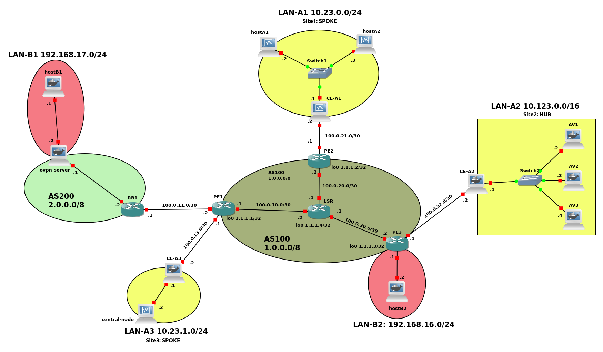

# Second Project for Network & System Defense 2022/2023

In this project, there are 2 Autonomous Systems that provide network connectivity to five private networks. AS100 provides a BGP/MPLS VPN service for the three sites of VPN A. AS200 is a customer of AS100 and hosts an OpenVPN server with a public IP address, used to provide an overlay VPN for the VPN client in LAN-B1.

In addition, you are expected to create a virtualized environment to test binaries for the presence of malware. In particular, you have to setup multiple virtual machines or containers in Site 2, each hosting a different AV of your choice. 

#### AS100
- Setup the necessary iBGP and eBGP peerings between internal and external routers (AS 200)
- Deploy MPLS with LDP in the AS100 core network
- Setup BGP/MPLS VPN to realize an Intra-AS VPN that connects the three sites of VPNA
  - Site 2 is the HUB, Sites 1 and 3 are the SPOKES
  - Spoke-to-spoke connectivity is enabled through the HUB
#### AS200
- Setup eBGP peering with AS100
- No need to setup OSPF between ovpn-server and RB1; static configuration is enough.
#### LAN-A1
- Setup MACsec in the LAN with MACsec Key Agreement protocol for all the devices in the LAN
- Realize a Firewall (with iptables/NETFILTER) in CE-A1 with the following security policies:
    - Permit traffic between LAN and external network only if initiated from the LAN, with dynamic source address translation
    - Deny all traffic to GW except ssh and ICMP only if initiated from the LAN
    - Permit traffic from GW to anywhere (and related response packets)
    - Permit port forwarding with DNAT to hostA1 and hostA2 from the external network only for the HTTP service
#### LAN-A2
Setup multiple virtual machines or containers, each hosting a different AV of your choice. 
A central node (in Site 3) will allow dropping an executable and distributing it to the various testing nodes. The testing nodes will scan/run the executables and deliver results to the central node, which will build a report to the user, showing what threats (if any) were discovered in the binary.
Given the criticality of this infrastructure, certain precautions must be taken:
- To prevent the exfiltration of threats on the network, nodes must be protected by a firewall implemented in CE-A2. The firewall must permit the bidirectional end-to-end communication between the central node and the AVs, and deny all the rest.
#### LAN-A3
LAN-A3 is Site 3 of the BGP/MPLS VPN in which there is just a Customer Edge, facing AS200, and one device in the private network that realizes the Central Node for binary distribution to the AVs in Site2.

In the central node, setup an external internet connection through a VirtualBox NAT interface.
#### OPENVPN
Setup OpenVPN with one server and one client. The server is in AS200, with a public IP taken from the 2.0.0.0/8 network. The client is host-B2, behind the private network in LAN-B2. The OpenVPN server provides access to LAN-B1 to which it serves as the gateway.

#### Authors
- [Michele Salvatori](https://github.com/michsalvv): 0306362
- [Danilo Dell'Orco](https://github.com/danilo-dellorco): 0300229
- [Jacopo Fabi](https://github.com/jacopofabi): 0293870